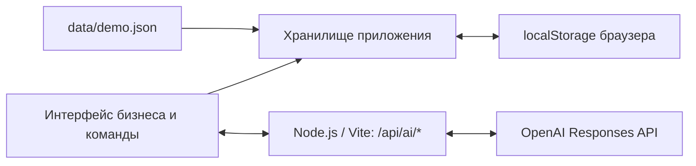

# Alem — задачи бизнеса для студенческих команд

**Alem** помогает бизнесу превратить краткое описание проблемы в понятную практическую задачу, а студентам — найти проект и предложить решение. AI задаёт уточняющие вопросы, собирает редактируемую карточку и оценивает, достаточно ли сведений для начала работы. Бизнес выбирает команды самостоятельно; студенты получают баллы за подтверждённый результат.

Проект команды **Chupapi** для HackAlem AI, кейс по геймификации практических заданий.

**Статус:** работающий локальный MVP без регистрации. Бизнес и команда переключаются в одном интерфейсе и используют данные одного браузера. Серверная часть подключена для AI; общей базы задач между пользователями пока нет.

## Что реализовано

| Сторона | Возможности |
| --- | --- |
| Бизнес | Создание и сохранение черновиков; 3–6 уточняющих вопросов; редактирование и предпросмотр карточки; рейтинг с пояснениями; подтверждение и публикация; удаление своих задач и черновиков; просмотр предложений и профилей команд; ручной выбор или отклонение; подтверждение результата этапа |
| Студенческая команда | Общий каталог, поиск, фильтры по теме и готовности; закладки; отправка идеи, плана, срока и ссылки на прототип; просмотр статуса предложения; сдача результата; профиль с интересами, навыками и технологиями; баллы за подтверждённые этапы |
| Общий интерфейс | Русский и казахский языки (**RU / ҚАЗ**), адаптация для телефона, сохранение состояния в браузере |

Уточняющие вопросы необязательны: можно пропустить любой, включая последний, или все вопросы. Короткое уточнение дополняет исходное описание, а не заменяет его. Ответы сохраняются при переходах и обновлении страницы.

Низкий рейтинг не скрывает опубликованную задачу и не запрещает отклик. После подтверждения изменённой карточки рейтинг пересчитывается при публикации. Удаление убирает задачу из каталога и активного кабинета, сохраняя историю предложений и уже начисленные баллы.

## Как работает решение

| Шаг | Действие | Результат |
| --- | --- | --- |
| 1. Черновик | Бизнес вводит название и описание проблемы | Сохраняется исходный текст |
| 2. Уточнение | AI задаёт 3–6 вопросов; бизнес отвечает или пропускает | Собираются дополнительные сведения |
| 3. Карточка | Система распределяет сведения по полям | Бизнес редактирует и подтверждает текст |
| 4. Рейтинг | AI оценивает содержание, сервер проверяет основания и считает баллы | Видны готовность и недостающие сведения |
| 5. Каталог | Бизнес публикует подтверждённую карточку | Задача появляется в общем каталоге, отсортированном по рейтингу |
| 6. Предложение | Команда отправляет идею, план, срок и ссылку | Бизнес получает предложение |
| 7. Выбор | Бизнес сравнивает предложения | Можно выбрать одну, несколько или ни одной команды |
| 8. Результат | Выбранная команда сдаёт этап, бизнес подтверждает его | Команде начисляется **10 баллов**, повторное начисление за тот же этап невозможно |

## Технологии

| Часть | Реализация |
| --- | --- |
| Интерфейс | HTML, CSS, JavaScript с ES-модулями, без UI-фреймворка |
| Сборка и локальный сервер | Vite 6, Node.js |
| AI | OpenAI Responses API; по умолчанию `gpt-5-mini`, задаётся через `OPENAI_MODEL` |
| Запросы | Встроенный `fetch`; строгая JSON-схема ответа модели и дополнительная проверка на сервере |
| Хранение | `localStorage`; стартовые синтетические данные в JSON |
| Локализация | Собственный словарь русского и казахского интерфейса |
| Тестирование | `node:test` и `node:assert`; ответы API в тестах подставные |
| Оформление | Собственные SVG-иконки, шрифт Golos Text через Google Fonts с системным запасным шрифтом |

Зависимости и команды зафиксированы в [`package.json`](package.json) и [`package-lock.json`](package-lock.json).

## Архитектура



Задачи, отклики и прогресс обрабатываются в браузере. AI-запросы проходят через сервер: он хранит ключ, проверяет входные данные, обращается к модели, проверяет структуру и цитаты в ответе, вычисляет рейтинг. Общая формула рейтинга также используется интерфейсом для проверки сохранённой оценки.

| Файл или каталог | Назначение |
| --- | --- |
| [`src/main.js`](src/main.js) | Навигация, переключение ролей и языка, общие события |
| [`src/business.js`](src/business.js) | Кабинет бизнеса, конструктор, публикация и решения по предложениям |
| [`src/student.js`](src/student.js) | Каталог, профиль команды, предложения и сдача результата |
| [`src/store.js`](src/store.js) | Данные, сохранение, выбор команд, удаление и начисление баллов |
| [`src/scoring.js`](src/scoring.js) | Критерии, формула, проверка цитат и актуальности оценки |
| [`src/ai-client.js`](src/ai-client.js), [`src/assistant.js`](src/assistant.js) | Запросы к серверу, отмена, проверка вопросов и локальный помощник |
| [`server/ai.js`](server/ai.js), [`vite.config.js`](vite.config.js) | AI-промпты, серверные маршруты и подключение OpenAI |
| [`src/ai-contract.js`](src/ai-contract.js) | Форматы входа и выхода, JSON-схемы, проверка источников карточки |
| [`data/demo.json`](data/demo.json), [`src/demo-migration.js`](src/demo-migration.js) | Синтетические данные и обновление нетронутых демозаписей |
| [`src/i18n.js`](src/i18n.js), [`src/locales/kk.js`](src/locales/kk.js) | Переключение языка и казахские переводы |
| [`tests/`](tests/) | Автоматические проверки логики и API |

Основные сущности: **Task** — задача и её оценка; **Team** — профиль команды; **Proposal** — предложение со статусом `pending`, `selected` или `rejected`; **Milestone** внутри предложения — результат со статусом `submitted` или `confirmed`.

Данные сохраняются под ключами `alem.workspace.v2`, `alem.editor.v2`, `alem.role` и `alem.locale`. Очистка данных сайта удаляет локальную историю.

## Установка и запуск

Нужны **Node.js 20.19+**, npm и современный браузер.

```bash
git clone https://github.com/BAITC-Hacks/hack-1cef21cf-chupapi.git
cd hack-1cef21cf-chupapi
npm ci
npm run dev
```

Открыть [http://localhost:5173](http://localhost:5173). Сервер слушает IPv4 и IPv6. Порт закреплён: если 5173 занят, Vite сообщит об ошибке вместо перехода на другой порт. Процесс `npm run dev` должен оставаться запущенным.

**Без API-ключа** приложение работает с явно обозначенным локальным помощником: он задаёт вопросы по правилам и собирает введённые ответы в карточку. Новые задачи в этом режиме не получают AI-оценку, но доступны для публикации и откликов.

### Подключение AI

1. Создать в корне `.env` по образцу [`.env.example`](.env.example). Существующий файл с ключом перезаписывать не нужно.
2. Заполнить настройки:

   ```dotenv
   OPENAI_API_KEY=ваш_ключ_проекта_OpenAI
   OPENAI_MODEL=gpt-5-mini
   ```

3. Перезапустить `npm run dev`.

`.env` исключён из Git. Ключ читает только сервер; префикс `VITE_` для него не используется. Реальные обращения к OpenAI оплачиваются по API-тарифу проекта. Ввод текста, переключение языка и открытие демоданных сами по себе не вызывают модель.

### Сборка и проверка

```bash
npm test
npm run build
npm run preview
```

`npm run preview` запускает собранное приложение вместе с AI-маршрутами; адрес выводится в терминале. Простой статический хостинг каталога `dist` не предоставляет эти маршруты.

Автоматические тесты проверяют рейтинг и его границы, подтверждение правок, пропуск вопросов, обработку ошибок AI, локализацию, состав данных, удаление, выбор команд и однократность начисления баллов. Тесты не выполняют платные API-запросы.

## Пример проверки для жюри

Сценарий проходит в одном браузере через переключение ролей. Для чистого просмотра можно открыть приложение в отдельном профиле браузера.

1. Выбрать **«Бизнес» → «Создать задачу»**. Ввести название `Проверка жюри: учёт заявок` и описание:

   > Три менеджера учебного центра ведут заявки в разных таблицах и теряют обращения. Нужен общий список заявок с поиском, статусами и ответственным менеджером.

2. Нажать **«Уточнить с AI»**. Проверить, что появились не менее трёх вопросов. Ответить на часть вопросов, а остальные пропустить кнопкой **«Не знаю, пропустить»**. После последнего вопроса должна открыться карточка; исходное описание должно сохраниться.

3. Раскрыть разделы карточки и при необходимости добавить тестовые сведения:

   | Поле | Пример |
   | --- | --- |
   | Контекст | Три менеджера вручную заносят около 30 заявок в день в отдельные таблицы |
   | Пользователи | Менеджеры обрабатывают заявки, руководитель просматривает статусы |
   | Данные | 200 обезличенных заявок в CSV; поля: id, дата, курс, статус, ответственный. Передадим в первый день |
   | Результат | Веб-прототип с импортом CSV, поиском и сменой статуса, исходный код и инструкция запуска |
   | Критерии успеха | 200 записей импортируются без потерь, дубли id не принимаются, поиск занимает до 5 секунд |
   | Ограничения | Три недели, только обезличенные данные, без платных сервисов |
   | Контакт | Координатор, jury@example.com — демонстрационный контакт |
   | Взаимодействие | Созвон по пятницам на 30 минут; ответы на вопросы в течение двух рабочих дней |

4. При подключённом AI нажать **«Оценить с AI»** и изучить пояснения. Точное число не является фиксированным эталоном: модель оценивает содержание, а демонстрационный контакт не даёт баллов. Без ключа должна отображаться надпись **«Готовность не оценена»**, а не выдуманные 100 баллов. Подтвердить сведения и нажать **«Опубликовать»**.

5. Переключиться на **«Команда»**, найти задачу по словам `Проверка жюри` и нажать **«Откликнуться»**. Заполнить:

   - Идея: `Соберём общий список заявок с поиском и назначением ответственного менеджера.`
   - План: `Сначала проверим CSV, затем сделаем импорт и интерфейс, после этого протестируем 200 записей.`
   - Срок: `3 недели`.
   - Ссылка: `https://example.com/prototype` — тестовый адрес, не действующий прототип.

6. Вернуться в **«Бизнес» → «Отклики команд»**, найти предложение Chupapi по этой задаче и нажать **«Выбрать команду»**. Выбор не должен происходить автоматически; остальные предложения остаются доступны для самостоятельного решения бизнеса.

7. В роли команды открыть **«Мои отклики» → «Сдать результат»**. Ввести `Готов импорт CSV и список заявок. Все 200 тестовых записей импортируются без потерь.` и тестовую ссылку `https://example.com/result`. Отправить на проверку. Затем в роли бизнеса подтвердить этап.

8. Открыть профиль команды: баланс должен увеличиться на **10 баллов**. Повторное подтверждение того же этапа недоступно. После обновления страницы данные и баллы сохраняются.

Дополнительно: переключить **RU / ҚАЗ** во время заполнения формы — введённый текст должен сохраниться. Удалить тестовую задачу со стороны бизнеса — она исчезнет из каталога, а история предложения и заработанные баллы останутся.

## Рейтинг готовности

| Критерий | Вес |
| --- | ---: |
| Контекст и потребность | 20 |
| Данные и материалы | 20 |
| Ожидаемый результат | 15 |
| Критерии успеха | 15 |
| Ограничения | 10 |
| Пользователи | 10 |
| Связь с бизнесом | 10 |

Модель оценивает каждое поле на уровне **0–4**: нет ответа, общее направление, частичные сведения, почти готово, достаточно для работы. Она возвращает причину и дословные цитаты из поля. Сервер проверяет основания и рассчитывает баллы:

```text
Баллы группы = вес × средний уровень её полей / 4
Итог = округлённая сумма баллов групп
```

Для групп «Контекст и потребность» и «Связь с бизнесом» берётся средний уровень двух полей. Поэтому полезные сведения учитываются, даже если соседнее поле не заполнено. Рейтинг не ограничен значениями 0 и 100.

| Баллы | Уровень | Поведение |
| --- | --- | --- |
| 0–39 | Требует уточнения | Задача остаётся в каталоге и принимает отклики |
| 40–69 | Рабочая | Доступна студентам в общем каталоге |
| 70–89 | Готовая | Находится выше менее подготовленных задач при сортировке |
| 90–100 | Приоритетная | Выделяется значком и оформлением рейтинга |

Оценка привязана к точному тексту карточки. Изменения сбрасывают подтверждение и делают старую оценку неактуальной. При подтверждённой публикации выполняется новая проверка; актуальная AI-оценка повторно не запрашивается. Неудачная повторная проверка неизменённого текста сохраняет прежнюю действительную оценку с пояснением.

Пустые ответы, известные отписки, одинаковый текст в нескольких полях и демонстрационный контакт не дают баллов за соответствующие поля. Для задачи без оценки интерфейс показывает **«Готовность не оценена»**; числовой 0 используется только для сортировки.

## AI: промпты, форматы и ошибки

Реализованы три содержательные функции: вопросы по недостающим сведениям, извлечение карточки из исходного текста и оценка конкретности сведений. Полные промпты находятся в [`server/ai.js`](server/ai.js): `QUESTION_PROMPT`, `CARD_PROMPT`, `REVIEW_PROMPT` и общие ограничения `PARTICIPANT_RULES`. JSON-схемы и проверка источников — в [`src/ai-contract.js`](src/ai-contract.js).

| Маршрут | Когда вызывается | Результат |
| --- | --- | --- |
| `POST /api/ai/questions` | По кнопке «Уточнить с AI» | 3–6 вопросов с ключами полей |
| `POST /api/ai/card` | После последнего вопроса | Карточка, оценка и балл |
| `POST /api/ai/review` | По кнопке оценки или при публикации без актуальной оценки | Проверка содержания без переписывания карточки |

Минимальный пример входа для вопросов:

```json
{
  "locale": "ru",
  "task": {
    "title": "Учёт заявок",
    "description": "Менеджеры учебного центра теряют заявки в нескольких таблицах. Нужен общий список с поиском и статусами."
  }
}
```

Допустимые поля `task`: `title`, `description`, `context`, `users`, `data`, `result`, `success`, `constraints`, `contact`, `interaction`, `category`, `weeks`. Неуказанные поля становятся пустыми строками. Язык — `ru` или `kk`, по умолчанию `ru`.

Пример формы ответа на запрос вопросов; конкретные формулировки зависят от входа:

```json
{
  "mode": "openai",
  "locale": "ru",
  "model": "gpt-5-mini",
  "questions": [
    {"key": "data", "question": "Какие обезличенные примеры заявок вы можете передать команде?"},
    {"key": "result", "question": "Какие действия менеджера должен поддерживать первый прототип?"},
    {"key": "success", "question": "Как вы проверите, что заявки больше не теряются?"}
  ]
}
```

Ответ карточки содержит `mode`, `locale`, `card`, `assessment` и `score`. В `assessment` хранятся версия рубрики, источник оценки, снимок текста и уровни полей с причинами и цитатами. При недоступной оценке `assessment` и `score` равны `null`; причина передаётся через `reason` и `notice`.

При сборке модель возвращает дословные фрагменты исходных строк. Сервер проверяет их присутствие в тексте и сохраняет уже заполненные пользователем поля. Неподтверждённые источниками фрагменты отклоняются. Бизнес проверяет смысл распределения сведений, редактирует карточку и подтверждает её до публикации.

Если нет ключа, API недоступен, превышен лимит или ответ некорректен, включается обозначенный локальный режим. Он сохраняет сведения и задаёт вопросы по правилам, но не подменяет семантическую оценку подсчётом заполненных полей. Если карточка уже проверена, а её оценка не прошла проверку, карточка сохраняется без балла.

Сервер допускает максимум одну попытку исправления некорректного ответа в пределах общего бюджета **60 секунд**; клиент ждёт до **65 секунд**. Лимит — **12 запросов в минуту с одного IP**. Исправление ответа может вызвать дополнительный платный запрос. Отмена в интерфейсе предотвращает публикацию, но не гарантирует отмену уже начатого запроса у провайдера. Для OpenAI используется `store: false`.

Профили команд и предложения участников не передаются модели. Промпт запрещает использовать личные и чувствительные признаки участников, выбирать команды и назначать исполнителей. AI обрабатывает только поля задачи; рабочий контакт оценивается по наличию канала связи.

## Данные и внешние сервисы

Единый синтетический набор — [`data/demo.json`](data/demo.json). Приложение импортирует этот же файл.

| Набор | Объём | Обязательные сведения |
| --- | ---: | --- |
| Черновики `drafts` | 5 | Описание, отрасль `industry`, сведения разной степени полноты |
| Карточки `tasks` | 5 | Все поля рейтинга, основания оценки `assessment`, текущий `score` |
| Команды `teams` | 6 | Название, интересы, навыки, технологии; пять внешних команд и Chupapi |
| Предложения `proposals` | 5 | Команда, задача, идея, план, срок, ссылка на прототип |

Стартовые баллы **95, 79, 54, 40 и 16** покрывают четыре уровня готовности. Это подготовленные вручную **демо-оценки**, помеченные в интерфейсе и полем `assessment.source: demo`. Они рассчитаны общей формулой из уровней и цитат и не являются результатом нового запроса к AI. Демоконтакты не дают баллов. При AI-проверке демо-оценка заменяется новой.

Организации, профили, контакты, предложения и ссылки набора синтетические. Адреса `example.com` служат примерами и не доказывают существование работающего прототипа. У Orbit подготовлен результат этапа для проверки подтверждения бизнесом.

Обновление демоданных сохраняет пользовательские правки, полученные оценки AI, удалённые записи и заработанные баллы. Подготовленные рейтинги добавляются только нетронутым стартовым карточкам.

Внешние сервисы: **OpenAI** для AI-функций и **Google Fonts** для шрифта. Приложение не проверяет содержимое ссылок на прототипы и результаты; их просматривает бизнес. Загрузка произвольного JSON/CSV через интерфейс пока не реализована: стартовый набор включён в репозиторий.

## Известные ограничения

- Нет общей базы данных, серверного CRUD задач и синхронизации между браузерами. Переключение ролей показывает сквозной сценарий на локальных данных.
- Нет регистрации, авторизации и серверного разграничения прав. Локальные проверки владельца задачи не являются защитой для многопользовательского сервиса.
- AI-маршруты встроены в Vite для локальной демонстрации и `preview`. Для публичной эксплуатации нужны отдельное серверное развёртывание и контроль доступа; статической публикации `dist` недостаточно для AI.
- Семантическая оценка модели может ошибаться. Проверка цитат не подтверждает реальное существование материалов и не гарантирует правильного распределения смысла между полями.
- В локальном режиме новые задачи публикуются без AI-рейтинга; содержательная оценка требует доступного API и ключа.
- На одно предложение реализован один этап с наградой 10 баллов. Несколько этапов, чат, уведомления и загрузка файлов не реализованы.
- Рекомендации по интересам и навыкам не реализованы; доступен общий каталог с поиском и фильтрами.
- Переводятся интерфейс и новые вопросы/пояснения AI. Пользовательский текст, синтетические карточки и уже полученные AI-ответы автоматически не переводятся.

## Развёрнутая версия

Публичного развёртывания пока нет. Проект запускается локально: [http://localhost:5173](http://localhost:5173).

Исходный код: [BAITC-Hacks/hack-1cef21cf-chupapi](https://github.com/BAITC-Hacks/hack-1cef21cf-chupapi), ветка `main`.
