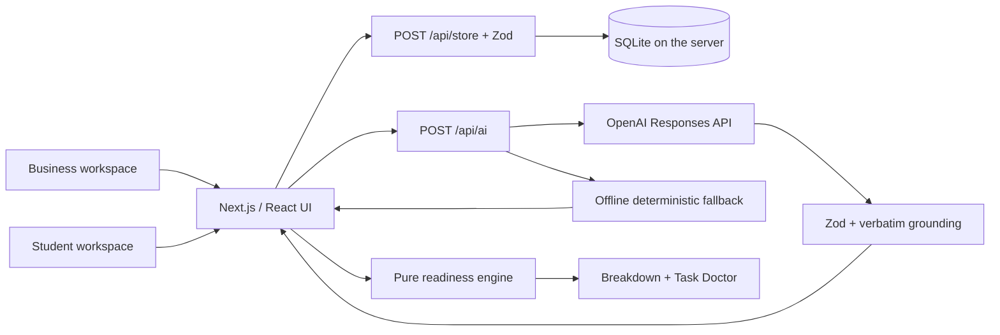

# ChallengeHub AI

**Turn vague business problems into student-ready challenges.**

AI Sana MVP with an X-inspired three-column interface, separate Business / Student workspaces, a **real SQLite database** and **OpenAI integration**. All source code is JavaScript / JSX.

## Problem

Businesses have real problems but often describe them too vaguely for student teams to start working. Missing data, unclear deliverables and undefined success criteria make collaboration difficult.

## Solution

Describe a problem, answer **three combined questions**, edit the structured card, review its readiness and publish it. Students submit proposals; the business manually accepts or rejects them. AI never chooses a team.

## Core Flow

Business Draft → AI Analysis → **3 Questions** → Editable Card → Readiness Score → Manual Confirmation → Publish → Student Proposal → Business Decision

The interview asks about:

1. The desired result and measurable success.
2. Available data and constraints.
3. Users, business contact and consultations.

Title and industry do not require separate interview questions. The generated card stays fully editable.

## Setup

Requires **Node.js 22.13+** for the built-in `node:sqlite` module, and npm. Node 22 may print an experimental SQLite warning; no separate database installation is needed.

```bash
npm install
npm run dev
```

Open **http://127.0.0.1:3000**.

Copy `.env.example` to `.env.local` and configure:

```dotenv
OPENAI_API_KEY=your_openai_api_key
OPENAI_MODEL=gpt-4.1-mini
DATABASE_PATH=./data/challengehub.sqlite
```

Put the real key only in `.env.local`, which is ignored by Git. Never put a credential in `.env.example` or a NEXT_PUBLIC variable. Restart the server after changing credentials.

```bash
npm run lint
npm test
npm run build
npm start
npm run test:e2e
node scripts/check-openai.mjs
```

The last command makes one **real, billable API request** using a synthetic coffee-shop brief and prints only the result mode, question count and grounding check. It does not print the key.

## Two workspaces

| Business                                      | Student                                        |
| --------------------------------------------- | ---------------------------------------------- |
| Business dashboard and creation shortcut      | Student dashboard and personal proposal counts |
| Create Challenge and three-question interview | Explore all published challenges               |
| My Challenges: drafts and published cards     | My Proposals: demo student submissions         |
| Edit, confirm, publish                        | Submit a team proposal                         |
| Review, Accept / Reject                       | Track Pending / Accepted / Rejected            |

The demo role switch remains intentionally simple; it is **not authentication**. The business account manages the shared demo workspace. The student account includes the DLX example plus new submissions. Multiple teams may be accepted.

## Database setup and persistence

SQLite creates its directory, schema and synthetic seed data automatically on the first API request. The file is `data/challengehub.sqlite` by default, with WAL journal files alongside it.

Tables:

- `challenges`: primary key, status, validated card and metadata JSON.
- `proposals`: primary key, foreign key to the challenge, validated proposal JSON.
- `metadata`: one-time seed marker.

Prepared SQL statements, foreign keys and transactions protect updates. Changes affect individual records rather than replacing the whole database. Publishing requires the **same card to have been confirmed on the server**; a student cannot submit to an unpublished challenge. Save success appears only after the server has actually committed.

**Tasks, proposals and decisions now belong to the server, not the browser.** Two browser profiles connected to the same running server see the same published challenges and decisions. Data survives reloads and server restarts. Views refresh on focus, role change and every 10 seconds while visible.

The role preference is still stored locally. If an older browser has `challengehub:v1` data, the business view offers **Import browser drafts**. It imports custom records once by ID without overwriting existing database records or deleting the browser backup.

Back up the database while the server is stopped, or use SQLite's supported backup mechanism. For hosting, use a persistent writable disk and one server instance; an ephemeral/serverless filesystem is not suitable. Keep `data/` and credentials out of Git.

## Architecture



Frontend: Next.js App Router, JavaScript/JSX, Tailwind, custom responsive CSS, Lucide and Sonner.
Backend: Next.js route handlers.
Database: Node's built-in SQLite driver.
Validation: Zod at client/server/provider boundaries.

### Project structure

```text
app/
  page.jsx                    Role-specific home
  challenges/page.jsx         Marketplace
  challenges/create/page.jsx  Short interview and editor
  challenges/[id]/page.jsx    Detail or saved draft
  my-challenges/page.jsx      Business workspace
  applications/page.jsx      Applications / My Proposals
  api/ai/route.js              OpenAI status and analysis endpoint
  api/store/route.js           Database reads and mutations
components/
  shell.jsx                   Navigation, roles, connection errors, import
  editor.jsx                  Describe / 3 questions / edit / publish
  store.jsx                   Async API-backed React store
  detail.jsx                  Challenge and proposal form
  workspace.jsx               Drafts and manual decisions
  feed.jsx                    Filters, ranking and search
  home-hero.jsx               Business / student dashboards
  readiness.jsx               Score and Task Doctor
lib/
  ai.js                       Interview contracts and offline fallback
  ai-server.js                Server-side OpenAI adapter
  database.js                 SQLite schema, transactions and operations
  readiness-score.js          Deterministic score
  schema.js                   Zod validation
  seed.js                     Synthetic data
scripts/check-openai.mjs       Opt-in real-provider smoke check
tests/                        Unit and browser tests
data/challengehub.sqlite       Runtime database, ignored by Git
```

## AI Usage

### What is sent

Analysis sends the problem description and the three supplied answers to OpenAI. Confirmation sends the description and edited card. Proposal review sends the proposal and its target challenge to check relevance. Unrelated records and database history are not sent. Requests use `store: false`.

The provider returns structured JSON:

```json
{
  "review": {"status": "approved", "summary": "A coherent brief; details can be added during the interview.", "issues": []},
  "card": {
    "title": null,
    "industry": null,
    "context": null,
    "problem": "We want AI to reduce queues in our coffee shops.",
    "users": null,
    "data": null,
    "constraints": null,
    "expectedResult": null,
    "successCriteria": null,
    "contact": null,
    "collaboration": null,
    "skills": null
  },
  "questions": [
    {
      "field": "outcome",
      "question": "What should the team deliver and how will success be measured?"
    },
    {
      "field": "resources",
      "question": "What order data and constraints should the team know about?"
    },
    {
      "field": "people",
      "question": "Who will use the solution and consult with the students?"
    }
  ]
}
```

There must be exactly one question for each group. OpenAI tailors questions to the description and language. Combined answers are split into card fields using explicit excerpts.

### Prompt and hallucination prevention

The core instruction is:

> Only use information explicitly provided by the user. If information is unknown, return null or mark it as missing. Never fabricate company data, metrics, constraints, contacts, deadlines or available datasets.

The full prompt also treats the description as data, asks for verbatim card excerpts, limits the interview to three groups and forbids additional title/industry questions.

A strict JSON Schema derived from Zod validates the response. Any generated card value absent from the user's description and answers is discarded. Semantic review separately checks relevance and contradictions. These safeguards reduce fabrication; they do not independently verify whether the user's claims are true. Manual review and confirmation remain required.

### Connection and fallback

- **REAL AI:** a successful OpenAI response, validated and grounded.
- **MOCK AI:** missing/invalid key, quota error, timeout, malformed output or network failure.
- The interface displays the actual mode and a specific reason, including invalid credentials (401) or quota/rate limits (429).
- Server timeout: 25 seconds; browser timeout: 35 seconds.
- `GET /api/ai` reports configuration presence and model, never the key. Presence alone is not proof that a key works.
- Offline mode produces three grouped questions and supports saving drafts. Confirmation, publication and proposal submission require successful semantic review; offline output never counts as approved.
- Sample demo answers are explicitly synthetic and only inserted on request.
- Readiness and Task Doctor guidance always use deterministic logic, never model-assigned points.

References: [OpenAI structured outputs](https://developers.openai.com/api/docs/guides/structured-outputs), [Node SQLite](https://nodejs.org/api/sqlite.html).

## Readiness Score

`calculateReadinessScore(card)` returns `{total, breakdown, missingFields, level}`.

| Category                           | Maximum |
| ---------------------------------- | ------: |
| Context and business need          |      20 |
| Data and materials                 |      20 |
| Expected result                    |      15 |
| Success criteria                   |      15 |
| Constraints                        |      10 |
| Users                              |      10 |
| Business contact and collaboration |      10 |
| **Total**                          | **100** |

Each field earns 0 for missing/unknown or fewer than 3 characters; 40%, 60%, 80% or 100% for 3–19, 20–39, 40–79 or 80+ characters, rounded to the nearest integer. Context/problem each have a 10-point maximum; contact/collaboration each have 5. Success criteria get up to 10 for detail plus 5 for a numeric target.

This is a transparent **completeness heuristic**, not truth or feasibility verification. Long repetitive text can inflate it.

Levels: Draft 0–39, Workable 40–69, Ready 70–89, Priority 90–100. Editing recalculates the score immediately. All published challenges remain visible; no minimum score is required for publication.

## Demo Scenario

1. Choose Business and Load Demo Scenario.
2. Analyze the weak coffee-shop brief.
3. Answer the **three** questions, or insert synthetic sample answers.
4. Generate the card, edit any field and watch the score change.
5. Confirm, then Publish.
6. In another browser profile connected to the same server, switch to Student.
7. Find the new challenge and submit a proposal.
8. Switch to Business, open Applications and manually Accept.
9. Reload My Proposals as Student to see Accepted.
10. Restart the server and verify the data still exists.

## Test Data

Five published cards, five drafts, five teams and five proposals are seeded only once. Everything is synthetic, including reserved example/test contact domains. Readiness values are calculated from the fields.

Business community counters 24 / 18 / 87 / 9 are labeled illustrative. Student counts reflect database activity.

## Tests and limitations

Unit tests cover scoring, grounding, provider response handling, three-question grouping, database persistence, duplicate-submission IDs and confirmation enforcement.

Playwright tests use a separate database and port 3100 with a local provider fixture to avoid API costs. They verify cross-browser publishing/proposals/acceptance, relevance rejection, forged-review protection, grouped sample answers, filters, mobile layout, role restrictions and failed-write behavior. Chrome must be installed; otherwise configure bundled Chromium.

Remaining boundaries: demo roles are not production authentication; real public deployment needs sessions, ownership enforcement and AI rate limits. SQLite needs persistent storage. No automatic team selection, chat, notifications, uploads, vector database or custom ML.

## AI relevance review (updated)

AI now has an explicit, visible purpose: interpret the problem, ask relevant questions, detect unrelated answers and contradictions, and structure the supplied information. It is not a fact-checking search engine.

Each AI response includes `review: {status, summary, issues}`. Each issue identifies a field, kind, severity, reason and a suggested correction. Possible statuses: `approved`, `needs_clarification`, `unavailable`. Missing details and unverified claims are warnings; nonsense, unrelated content, contradictory requirements and prompt-injection instructions can block progression.

Checks run on the description, all supplied interview answers, **all edited card fields on confirmation**, and each student proposal against its challenge. A rejected interview stays on the same step with actionable explanations. Approved content is still explicitly labeled as author-supplied, not independently verified.

The server ignores client-supplied review results. Publication requires a previously confirmed, reviewed, unchanged card and description. Editing invalidates confirmation. Proposal review checks relevance only; the business still chooses teams manually. The readiness score and Task Doctor checklist measure completeness independently of AI review.

When OpenAI is unavailable, an offline draft can still be prepared and saved. **Confirmation, publication and proposal submission fail closed** until semantic review succeeds. This supersedes the earlier unrestricted offline-demo behavior. Old browser challenges import as unreviewed drafts; old proposals remain in the browser backup for review and resubmission. Previously published/seeded records are not retroactively certified.

Browser tests use `scripts/test-server.mjs`, a local deterministic provider fixture with a separate SQLite database. They do not use the real key. `node scripts/check-quality.mjs` makes three opt-in billable real-provider checks: unrelated answers, a coherent brief and contradictory constraints. Like any model assessment, semantic review may still make mistakes; it cannot guarantee detection of all misleading claims.
